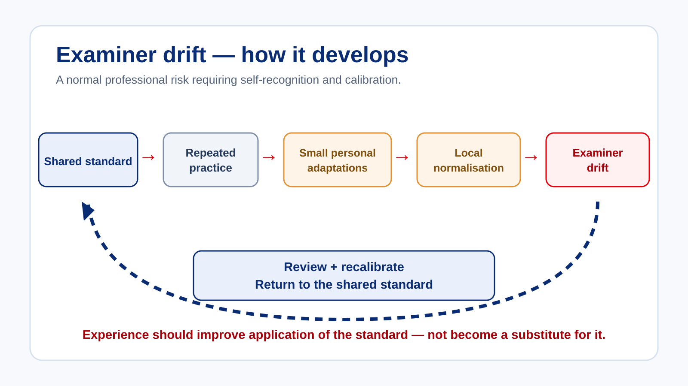

# Authority, Independence and Examiner Drift

The initial Examiner Course establishes that examiner authority is delegated and bounded. The recurrent question is how professional independence is maintained after you become familiar with candidates, instructors, operators and local practice.

## Professional independence

You may understand the operational consequences of a delay, sympathise with a candidate or know that a candidate has previously performed strongly. Those circumstances may be legitimate. They do not alter the required standard.

> **Important:** Experience may make an examiner faster at finding the answer, but it does not enlarge the examiner’s authority.

## Examiner drift

For this programme, *examiner drift* means a gradual movement away from a shared interpretation or application of the required standard. It is a professional-development concept, not a formal regulatory term.

| Mechanism | How it may appear |
| --- | --- |
| Routine | Validity checks or evidence requirements become treated as administrative because the assessment feels familiar. |
| Local normalisation | A practice is accepted because “that is how we do it here” rather than because it is anchored to a requirement or standard. |
| Personal technique preference | You start expecting candidates to use your preferred method rather than any acceptable method. |
| Experience confidence | You increasingly rely on intuition and record less objective evidence. |
| Pressure adaptation | Repeated scheduling or commercial pressure gradually changes what you are willing to accept. |
| Familiarity | Known candidates or instructors unconsciously receive greater benefit of the doubt. |
| Isolation | Limited calibration allows personal interpretation to become your default standard. |

## Controls that interrupt drift

Drift is easier to control when it is made visible early. Practical controls include:

- state the applicable standard before relying on a preferred technique;
- use a short evidence note even when the candidate is familiar or the outcome feels obvious;
- name commercial, scheduling or staffing pressure before it changes the decision;
- ask another experienced examiner to review a genuinely difficult or repeated judgement issue;
- compare local practice with the approved requirement rather than treating repetition as proof; and
- revisit an early conclusion by asking what evidence would change it.

These controls support professional independence. They are not accusations of misconduct and do not require a finding that drift has already occurred.

<strong>Reflection</strong> Which drift mechanism is most plausible in your examining environment? Select one and identify one practical control that would help prevent it.

<strong>Useful controls</strong> may include deliberate evidence notes, checking the published criteria, naming operational pressure, seeking peer calibration, or asking what evidence would change your initial view.

## Scenario — the familiar candidate

You are assessing a pilot you have known professionally for several years. The candidate is experienced and well regarded. The operator is short of qualified personnel. During today’s assessment the candidate’s technical handling is strong, but several judgement and threat-management concerns emerge. You notice yourself thinking: “They’re normally better than this.”

At the decision point, give greatest weight to the observable evidence from today’s assessment. Previous performance, operator confidence and operational consequences may influence you, but they do not replace current evidence against the applicable standard.

## Key takeaways

- Delegated authority has boundaries even when experience and confidence grow.
- Familiarity, local practice and pressure are professional threats to notice and control.
- The current assessment evidence remains the anchor for the decision.

## Apply it to a local practice

Choose one assessment practice that is commonly described as “how we do it here”. Write:

1. what the practice is;
2. which part is supported by a requirement or standard;
3. which part is only a local preference; and
4. what calibration or review would clarify the boundary.

The aim is to distinguish an acceptable technique from an unexamined local standard.
