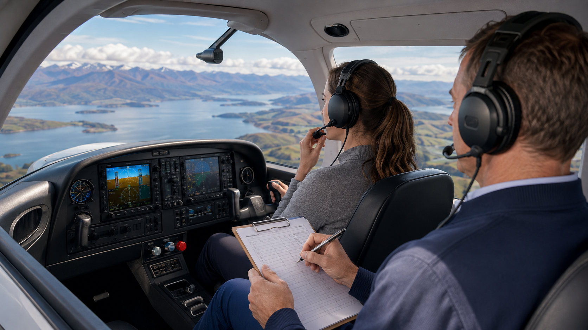

# Conducting the Assessment

During a live assessment, you are simultaneously observing performance, monitoring safety, gathering evidence, managing communication and deciding whether the assessment can continue validly.

## Observation discipline

- Observe the whole performance rather than allowing one strong or weak event to dominate.
- Keep gathering evidence after an early positive or negative impression has formed.
- Record concise, observable facts rather than conclusions.
- Manage note-taking so it supports, rather than competes with, situational awareness.
- Treat unexpected operational events as potential evidence of judgement and adaptability.

## The intervention continuum

| Examiner response | Typical purpose |
| --- | --- |
| Observe | Allow the event to continue while gathering evidence where no immediate safety consequence exists. |
| Monitor more closely | Increase attention as risk, workload or repeated error begins to develop. |
| Minimal safety prompt | Use only where necessary to prevent escalation and where limited cueing remains consistent with safe conduct. |
| Intervene | Act directly when an unsafe outcome is becoming likely or safety can no longer be protected by observation alone. |
| Pause / terminate | Stop or reset when safety, fairness or assessment validity can no longer be maintained. |

> **Important:** The decision to intervene is a safety decision. The meaning of that intervention for the assessment outcome is a separate professional judgement based on context, timing, severity and the standard being assessed.

## Protecting observation while managing safety

The examiner’s task is not passive observation. It is active management of the boundary between gathering evidence and protecting safety or validity.

| Ask yourself | Why it matters |
| --- | --- |
| Is there an immediate safety consequence if I continue observing? | Safety action may take priority over further evidence. |
| Can the event continue without an examiner cue? | Unnecessary prompting can change the evidential value. |
| What exactly did I observe before acting? | The pre-intervention record helps preserve the original evidence. |
| What did my action make possible or impossible to observe? | Intervention may affect later interpretation. |
| Can the assessment remain fair and valid after the intervention? | Safety action and assessment outcome are related but separate decisions. |

If intervention is necessary, use the minimum action consistent with safe conduct and record the reason, timing and effect. Do not let a safety intervention become an automatic assessment conclusion.

## Scenario — incorrect frequency entry

During a flight assessment, the candidate is instructed to change to a new radio frequency. The candidate enters one digit incorrectly and makes a call. There is no response. After a short period, the candidate checks the radio, identifies the incorrect frequency, enters the correct frequency and establishes communication. The remainder of the sequence continues normally.

Self-check — What is the best examiner response?

<ol type="A">
<li>Treat the error itself as evidence that the required standard has not been met.</li>
<li>Continue the assessment and consider the error, recognition and recovery in context with the rest of the evidence.</li>
<li>Ignore the event completely because communication was eventually established.</li>
<li>Immediately tell the candidate which digit was entered incorrectly.</li>
</ol>

<strong>Model reasoning:</strong> B. The error is observable evidence, but its significance depends on context: whether it was isolated or part of a wider pattern, how independently and promptly it was recognised, the quality of the recovery and how the event relates to the applicable standard. Recovery adds evidence; it does not erase the original error.

## Objective notes

| Weak note | More defensible note |
| --- | --- |
| Poor situational awareness | Failed to identify conflicting traffic despite two opportunities and no effective visual scan observed. |
| Bad judgement | Continued approach after agreed stabilisation criteria were not met. |
| Overloaded | Missed radio call, omitted checklist and required repeated heading correction during high-workload arrival. |

## Apply it

Before the next assessment, decide what you will do when an event is concerning but not yet unsafe. Name the observation threshold, the safety threshold and the point at which assessment validity may no longer be maintained.

> **TEM Reflection:** Which error would you be most tempted to correct early because it feels uncomfortable to watch? What would you need to observe before deciding that a prompt is necessary?
