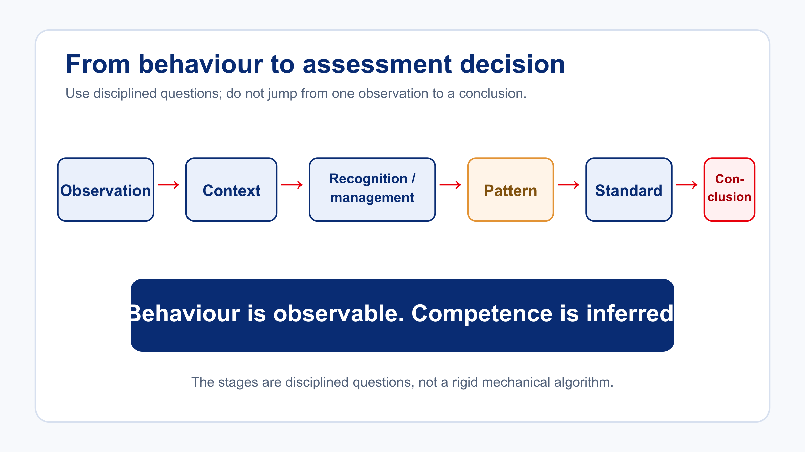

# Interpreting Human Performance

The initial Examiner Course introduced Threat and Error Management (TEM), human factors and NOTECHS. This recurrent lesson assumes that knowledge. The focus here is interpretation.

> **Key principle:** Behaviour is observable. Competence is inferred.

## From observation to conclusion

Suppose the candidate misses a checklist item. That is an observation. Possible interpretations include momentary distraction, ineffective workload management, poor procedural discipline, fixation, inadequate planning or an isolated error of little wider significance.

Do not jump immediately from observation to conclusion. Use this disciplined sequence:

1. What did I observe?
2. What was happening around the candidate?
3. How did the candidate recognise and manage it?
4. Did similar behaviour occur elsewhere?
5. Which competency or standard is relevant?
6. What conclusion does the evidence support?

## Use TEM and NOTECHS as evidence lenses

TEM, human factors and NOTECHS help organise what is observed; they do not supply a conclusion by themselves. For example, an examiner may record the threat context, the error, the candidate’s recognition, the management response and the resulting outcome. The relevant competency or standard is then used to interpret that sequence.

Avoid turning a label into a finding. “Poor situational awareness” is a conclusion that needs observable evidence beneath it. A useful record lets another examiner see the context and the behaviour before agreeing or disagreeing with the interpretation.

### Worked example

**Observation:** Weather deteriorated, the candidate continued toward it, available alternatives were not discussed, and the candidate diverted after receiving further information.

**Possible interpretation:** The timing and quality of threat recognition and decision-making require examination.

**Next question:** What does the applicable standard require, and what additional evidence is needed to decide whether the behaviour demonstrates the competency?

### Compact evidence crosswalk

Use the established TEM and NOTECHS concepts as organising lenses rather than as automatic findings:

| What you observe | Organising lens | What to examine next |
| --- | --- | --- |
| Weather deteriorates while alternatives remain available. | Threat context | What information was available, and how did it affect planning? |
| A radio call is missed during increased workload. | Error / workload evidence | Was it recognised, managed and repeated? |
| The candidate diverts after receiving further information. | Management and decision-making evidence | How timely, independent and effective was the response? |
| Communication becomes shorter and less organised. | Communication / coordination evidence | Did this affect shared understanding or the ability to manage the assessment? |

The table organises inquiry; it does not replace the approved competency or standard. Record the observable behaviour first, then explain which evidence supports the interpretation.

## Technical performance is not the whole picture

A candidate may demonstrate excellent aircraft handling while showing weakness in threat recognition, prioritisation, situational awareness, decision-making, workload management or communication.

Likewise, a candidate may make minor technical errors while demonstrating strong operational judgement and effective error management. Do not artificially collapse strong technical evidence and weaker decision-making evidence into one overall impression. Identify both and determine their significance against the applicable competencies and standards.

## Scenario — the smooth flight

A candidate flies accurately and confidently. Aircraft handling is consistently strong. However, as the flight progresses, weather deteriorates, alternative options are available, the candidate continues toward the weather, decision-making becomes increasingly reactive and threat recognition appears weak.

Self-check — Which statement is most appropriate?

<ol type="A">
<li>Strong aircraft handling demonstrates overall competence.</li>
<li>Poor judgement automatically overrides all technical evidence.</li>
<li>Recognise the strong technical evidence and the weaker decision-making evidence separately, then assess both against the required standard.</li>
<li>Wait for a technical error before becoming concerned.</li>
</ol>

<strong>Model reasoning:</strong> C. Assessment evidence should not be artificially collapsed into a single impression. A candidate may simultaneously demonstrate strong technical handling and weak operational judgement; identify both and determine their significance against the applicable competencies and standards.

The appropriate interpretation is to recognise the strong technical evidence and the weaker decision-making evidence separately, then assess both against the required standard. Do not wait for a technical error before becoming concerned, and do not assume that poor judgement automatically overrides all technical evidence.

## Apply it

When you write an assessment note, first describe the behaviour and context. Only then record the professional interpretation and the standard or competency to which it relates.
