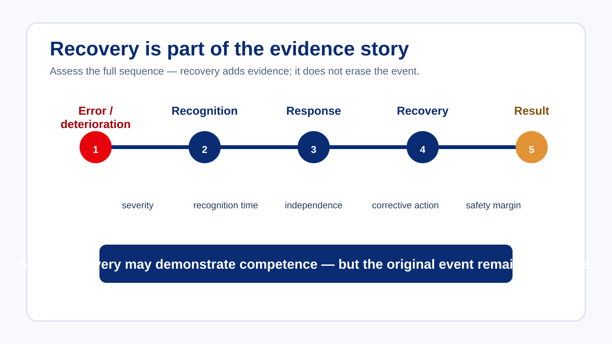

# Errors, Recovery and Examiner Bias

Errors occur even during competent performance. Ask more than “Was there an error?” Also consider:

- Was it recognised?
- How quickly?
- Was recovery independent?
- Was the corrective action appropriate?
- Were consequences effectively managed?
- Did the behaviour recur?
- What safety margin remained?

## Recovery is evidence

A candidate who recognises an error, stops deterioration, reprioritises, corrects effectively and restores safe operation may provide valuable evidence of competence.

Recovery does not erase the original event. Assess the complete sequence, including severity, recognition time, independence, quality of corrective action, safety margin and recurrence.

## Scenario — the excellent recovery

During a high-workload phase, a candidate becomes distracted by an unexpected system issue. Situational awareness deteriorates and the candidate initially fails to recognise the developing problem. After approximately thirty seconds, the candidate recognises the situation, deliberately slows the operation, reprioritises correctly, communicates effectively, re-establishes situational awareness and safely completes the exercise.

Both the deterioration and the recovery are relevant assessment evidence. A good recovery can demonstrate valuable competencies, but it does not make the earlier event disappear.

## Examiner cognition matters too

| Judgement trap | Description |
| --- | --- |
| Halo effect | An early positive impression colours later observations. |
| Horn effect | One poor event causes subsequent performance to be viewed negatively. |
| Confirmation bias | You begin looking for evidence supporting an existing conclusion. |
| Recency effect | Recent events receive disproportionate weight. |
| Expectation bias | Reputation or prior knowledge influences what you expect to observe. |

> **Control question:** Whenever you notice yourself reaching an early conclusion, ask: “What evidence would cause me to change my mind?” If the answer is “nothing”, judgement may already have closed too early.
