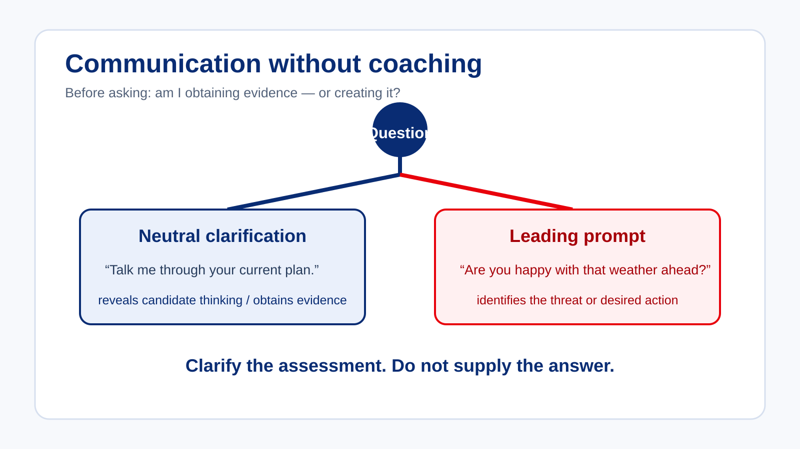

# Communication Without Coaching

Communication is necessary throughout an assessment, but examiner communication can also change the evidence being gathered.

> **Control question:** “Am I clarifying the assessment — or helping the candidate perform it?”

## Clarification versus assistance

Appropriate communication may include:

- clarifying an instruction;
- confirming that the candidate understood the task;
- requesting an explanation of a decision;
- obtaining evidence that cannot reasonably be observed directly;
- managing assessment sequencing;
- managing the assessment appropriately; and
- dealing with genuine ambiguity.

Communication becomes problematic when it begins to:

- lead the candidate toward the desired answer;
- identify an error or issue the candidate has not recognised;
- tell the candidate what action to take;
- provide repeated prompts that enable successful performance;
- rescue the candidate from a decision they should make independently; or
- convert assessment into instruction.

## Briefing and listening discipline

At the start of an assessment, a clear briefing helps the candidate understand the task, sequencing and communication expectations without disclosing how to solve the task. During the assessment, active listening means attending to the candidate’s words, timing, priorities and reasoning rather than listening only for a phrase that confirms your first impression.

Use a simple listening loop:

1. listen without filling the silence;
2. identify what the candidate actually said or did;
3. clarify only what is genuinely ambiguous; and
4. record the evidence before interpreting it.

The loop protects both candidate independence and examiner neutrality.

## Scenario — the helpful examiner

During a flight assessment, the candidate is instructed to change to a new radio frequency. The candidate enters one digit incorrectly and makes a call. There is no response. Before the candidate has checked the selection, the examiner asks: “Are you sure you entered the right frequency?” The candidate immediately checks the radio, identifies the error, selects the correct frequency and establishes communication.

The main concern is that the examiner’s question identified the likely error and influenced the evidence. The eventual correction may have been appropriate, but it does not show how independently the candidate would have recognised the incorrect selection.

If there is no need to intervene, continued observation may provide better evidence. If clarification is necessary, a neutral question may sometimes be more appropriate:

> “Talk me through what you are doing with the radio.”

Even neutral questioning must not become repeated assistance.

## A question-quality check

Before asking, test the question against four points:

1. **Purpose:** What evidence do I need, and why can it not be observed directly?
2. **Neutrality:** Does the wording leave the candidate to identify the issue or action?
3. **Timing:** Can I wait without compromising safety, fairness or assessment validity?
4. **Effect:** What will the candidate’s answer or action mean after I have asked?

If the question identifies the error, desired answer or threat, it may change what the candidate demonstrates. If intervention is required for safety, record the pre-intervention observation and consider the intervention’s effect on the remaining evidence.

| More neutral | More leading |
| --- | --- |
| “Talk me through your current plan.” | “Are you happy with that weather ahead?” |
| “What information are you using?” | “Have you considered the traffic on the left?” |
| “Explain what you are checking.” | “Did you forget to check the frequency?” |

## Apply it

Before asking a supplementary question, decide whether it obtains evidence or creates it. If safety requires intervention, record what was observed before and after the intervention and consider how the intervention affects the evidential value.
