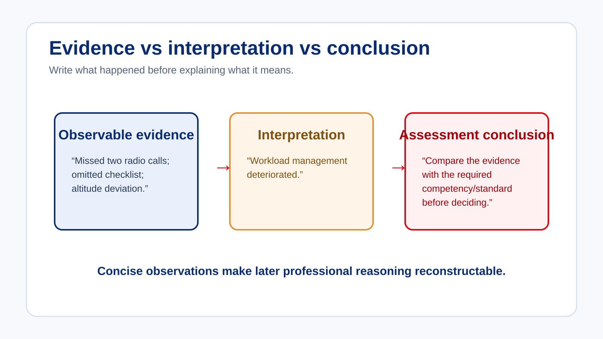

# Evidence, Notes and Defensible Records

Examiner notes have two purposes: they support judgement during the assessment and preserve the evidence after the assessment.

> **Control question:** “Could I reconstruct the important reasoning from these notes several months later?”

## Record what happened

| Weak note | Stronger evidence note |
| --- | --- |
| Poor judgement | Continued approach after stabilisation criteria were no longer met. |
| Weak SA | Did not identify conflicting traffic despite two opportunities. |
| Overloaded | Missed radio call, omitted checklist item and required repeated heading correction. |
| Bad TEM | Identified deteriorating weather but continued without discussing available alternatives. |
| Poor communication | Readback omitted altitude restriction and error was not recognised until ATC correction. |

## Separate evidence from interpretation

“Candidate became overloaded” is already an interpretation. A stronger record might be:

> “During arrival: missed radio call; checklist not completed; altitude deviation 180 ft; required repeated heading correction.”

You can then explain why those observations supported a workload-management judgement.

## Record enough — not everything

Excessive note-taking can:

- increase examiner workload;
- reduce observation quality;
- reduce situational awareness; and
- distract from safety monitoring.

The objective is sufficient evidence, not maximum words.

## The minimum sufficient record

A useful record should allow a later reviewer to answer:

- What happened, and in what sequence?
- What context or information was available?
- What did the candidate recognise and manage independently?
- What did the examiner say or do, if intervention occurred?
- Which evidence was positive, concerning or repeated?
- Which standard or competency controlled the interpretation?
- Why did the final conclusion follow from the evidence?

## Pattern recognition without assumption

When similar events occur, compare them explicitly rather than writing “repeated poor performance”. Record the event, context, recognition, recovery and result for each occurrence, then state what pattern—if any—the comparison supports. A pattern is not created merely by counting events; its significance depends on recurrence, context, severity, independence and the applicable standard.

Record enough to support the reasoning, not every detail of the flight. A concise record can be stronger than a long record if it preserves the decision-relevant observations and avoids unsupported labels.

### Reconstruction test

Set the notes aside, then ask another experienced examiner to explain the likely reasoning from the record alone. If they need to rely on your memory, reputation or informal explanation, the record needs more observable evidence or a clearer standard link.

## Apply it

Rewrite one vague assessment label into a short sequence of observable actions, context and outcome. Then identify the competency or standard against which you would interpret it.
