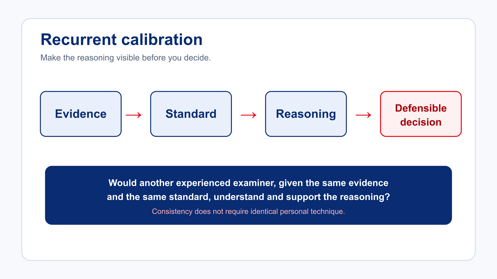

# Review and Completion

## Key points

- Experience should strengthen professional discipline, not create a personal assessment standard.
- Examiner behaviour influences the assessment environment.
- Questions should obtain evidence rather than create it.
- Neutral clarification is different from coaching.
- Candidates do not have to agree with an assessment decision for the decision to be professionally valid.
- Difficult debriefs should return repeatedly to evidence and standards.
- Examiner notes should record observable behaviour rather than unsupported labels.
- Recovery and positive performance should be recorded even where the overall outcome is unsuccessful.
- Good documentation allows the examiner’s reasoning to be reconstructed later.
- Examiner standardisation depends upon transparent professional reasoning.

## Final check before the quiz

Ask yourself:

1. Is my authority grounded in evidence and the applicable standard?
2. Am I obtaining evidence or creating it through the way I question?
3. Can I acknowledge a candidate’s reaction without conceding the decision?
4. Could another professional reconstruct the assessment from my notes?
5. Have I recorded recovery and positive performance as well as concerns?

Complete the Block 3 knowledge check to record your understanding. It is a formative knowledge check; FTNZ has not specified a formal pass mark in the supplied source. Review and retry any questions that need attention.

The [optional Block 3 defensible-practice aid](./downloads/block-3-defensible-practice-aid.md) is available for later field use; it is not an additional mandatory lesson.

## Source review questions

These self-checks reproduce the final review questions from the master course. Decide before opening each model explanation.

Review 1 — What is the main risk when an examiner asks a leading question?

<ol type="A">
<li>It makes the assessment longer.</li>
<li>It may create or influence the evidence being assessed.</li>
<li>Candidates dislike being questioned.</li>
<li>Questions are prohibited during flight tests.</li>
</ol>

<strong>Model reasoning:</strong> B. Leading questions can change the evidential value of the candidate’s subsequent actions.

Review 2 — A candidate says another examiner would have passed the performance. What is the strongest response?

<ol type="A">
<li>Defend the examiner profession.</li>
<li>Criticise the other examiner.</li>
<li>Return to the evidence from the current assessment and the applicable standard.</li>
<li>End the debrief immediately.</li>
</ol>

<strong>Model reasoning:</strong> C. Explain the current assessment rather than speculate about another examiner.

Review 3 — Which note is most defensible?

<ol type="A">
<li>Poor situational awareness.</li>
<li>Candidate appeared overloaded.</li>
<li>Missed two radio calls, omitted checklist and exceeded assigned altitude before correcting.</li>
<li>Needs more practice.</li>
</ol>

<strong>Model reasoning:</strong> C. It records observable behaviour rather than an unsupported interpretation.

Review 4 — Why should strong recovery be included in the assessment record?

<ol type="A">
<li>Because recovery automatically cancels the original error.</li>
<li>Because it is part of the complete evidence story.</li>
<li>Because unsuccessful candidates must receive positive comments.</li>
<li>Because recovery always demonstrates competence.</li>
</ol>

<strong>Model reasoning:</strong> B. Recovery is relevant evidence and should be considered alongside the original event.

Review 5 — Which statement best describes professional examiner authority?

<ol type="A">
<li>The examiner’s experience determines the standard.</li>
<li>The examiner should avoid explaining difficult decisions.</li>
<li>Authority is demonstrated through calm, evidence-based application and explanation of the required standard.</li>
<li>Candidates should not be permitted to question an outcome.</li>
</ol>

<strong>Model reasoning:</strong> C. Professional authority comes from disciplined application and explanation of evidence and standards.

## Completion position

The assessment outcome is only one part of examiner professionalism. The way the assessment is conducted, evidenced, communicated and recorded must be equally defensible.

> **TEM Reflection:** What communication habit will you monitor so that it supports evidence gathering without coaching?
